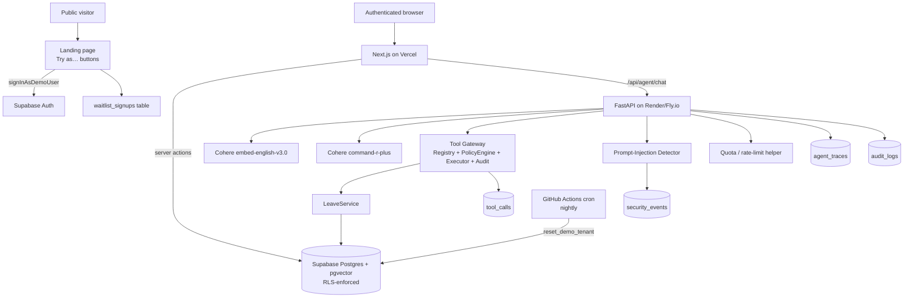

# Architecture

## System diagram



## Agent flow (one request)

```
User message
  ↓
Authenticated session (Supabase JWT verified server-side)
  ↓
Agent orchestrator (FastAPI)
  ↓
Prompt-injection detector on user input  →  security_events on block
  ↓
Embed query (Cohere) → match_document_chunks(filter_tenant, filter_tags=accessible_tags(role))
  ↓
Prompt-injection detector on retrieved text  →  mark suspicious chunks
  ↓
Build prompt with UNTRUSTED_DOCUMENT_BLOCK fence (retrieved text is data, not instructions)
  ↓
Cohere command-r-plus proposes tool call(s)
  ↓
Tool Gateway validates (auth, tenant, role, agent perms, schema, rate limit)
  ↓
Tool executes through shared LeaveService / RAG function (Postgres)
  ↓
tool_calls row written (allow or deny), audit_logs row written for sensitive actions
  ↓
Model receives structured {ok, data, error} result
  ↓
agent_traces row written (retrieval, tool calls, blocked events, latencies, tokens)
  ↓
Final answer streamed to browser
```

## Defense-in-depth (prompt injection)

1. Retrieved text wrapped in `UNTRUSTED_DOCUMENT_BLOCK`; system prompt treats it as data, not commands.
2. ACL-filtered retrieval — restricted tags never enter the prompt.
3. Suspicious-pattern detector on user input and retrieved chunks.
4. All tool inputs Pydantic-validated.
5. All tool calls server-authorized by tenant/role/scope.
6. Sensitive actions logged to `audit_logs` + `security_events`.
7. Model output is never trusted as authorization — every decision is re-derived from the DB.

## Two-tier approval (kept separate)

- **Tool-execution authorization** (always enforced server-side by the gateway).
- **Business workflow approval** (manager approves a `pending` leave request).

`create_time_off_request` is workflow-pending, not tool-blocked. The `dangerous` tool flag is scaffolded for future `send_email` / `run_sql` / `external_api_call` tools but unused in MVP.
